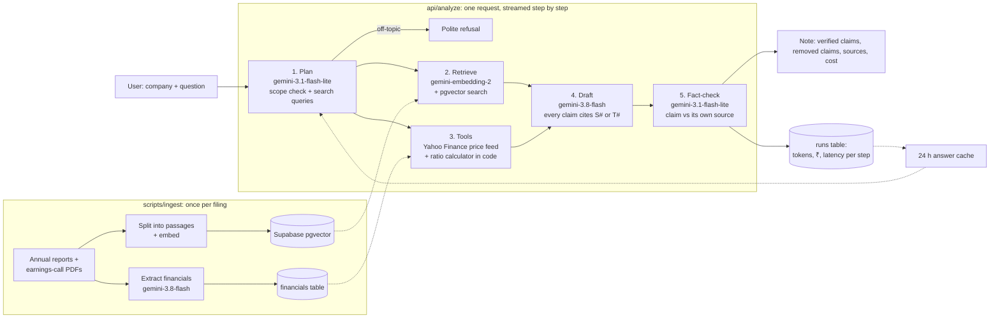

# Architecture

**Why these models (hybrid of tiers, one provider):**
- A proprietary API (Gemini) instead of an open model: no GPU to host, strong at long financial documents, and a free tier for development.
- The cheapest model handles planning and fact-checking, which are short, structured tasks. The stronger model is used only for writing, where quality shows.
- Each tier has a fallback chain, because the most popular models return 503 errors at peak times.
