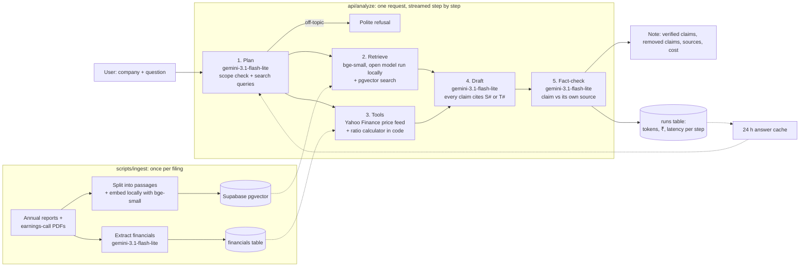

# Architecture

**Why these models (hybrid of tiers, one provider):**
- A proprietary API (Gemini) instead of an open model: no GPU to host, strong at long financial documents, and a free tier for development.
- One fast, cheap model (Gemini 3.1 Flash-Lite) does planning, writing and fact-checking. We planned to write with the stronger gemini-3.8-flash, but the free tier allows it only 20 requests a day; Flash-Lite still reached 93% fully supported claims in our 17-question evaluation, at roughly a third of the price. With billing, the stronger writer is one setting away (WRITER_MODELS).
- Each tier has a fallback chain (gemini-3.5-flash-lite as backup), because popular models return 503 errors at peak times. Every AI call has a hard 25-second deadline.
- Embeddings use an **open model run locally** (BAAI bge-small-en-v1.5, 384 dimensions, via ONNX Runtime). It is free with no quota, which matters because the free Gemini tier allows only 1,000 embedding requests a day and our 12 companies need about 11,000 passages embedded. Search quality is slightly lower than Gemini's embedding model, but the fact-checker catches claims built on weak passages.
